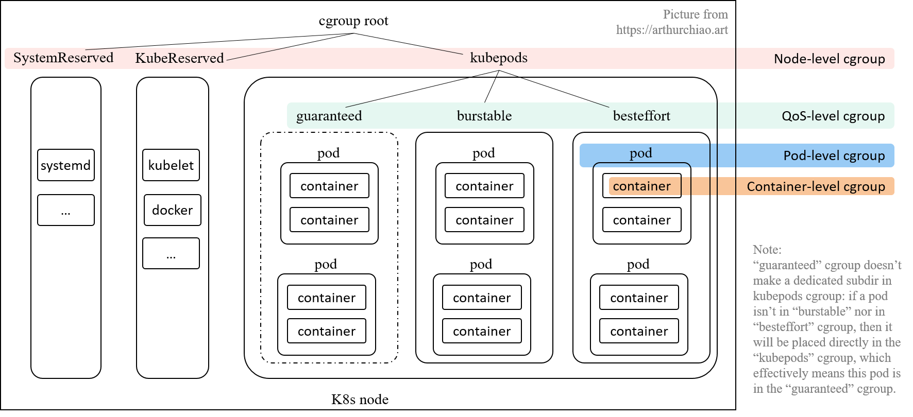

# cgroup基础

cgroup 是 Linux 内核基础设施，可以**限制、记录和隔离进程组**（process groups） **使用的资源量**（CPU、内存、IO 等）。

cgroup 有两个版本，v1 和 v2，二者的区别可参考 [Control Group v2 (cgroupv2 权威指南)（KernelDoc, 2021）](https://arthurchiao.art/blog/cgroupv2-zh/)。 目前 k8s 默认使用的是 cgroup v1，因此本文以 v1 为主。

cgroup v1 能管理很多种类的资源，

```
$ mount | grep cgroup
tmpfs on /sys/fs/cgroup type tmpfs (ro,nosuid,nodev,noexec,mode=755)
cgroup on /sys/fs/cgroup/systemd type cgroup (rw,nosuid,nodev,noexec,relatime,xattr,release_agent=/usr/lib/systemd/systemd-cgroups-agent,name=systemd)
cgroup on /sys/fs/cgroup/perf_event type cgroup (rw,nosuid,nodev,noexec,relatime,perf_event)
cgroup on /sys/fs/cgroup/cpuset type cgroup (rw,nosuid,nodev,noexec,relatime,cpuset)
cgroup on /sys/fs/cgroup/freezer type cgroup (rw,nosuid,nodev,noexec,relatime,freezer)
cgroup on /sys/fs/cgroup/pids type cgroup (rw,nosuid,nodev,noexec,relatime,pids)
cgroup on /sys/fs/cgroup/hugetlb type cgroup (rw,nosuid,nodev,noexec,relatime,hugetlb)
cgroup on /sys/fs/cgroup/devices type cgroup (rw,nosuid,nodev,noexec,relatime,devices)
cgroup on /sys/fs/cgroup/blkio type cgroup (rw,nosuid,nodev,noexec,relatime,blkio)
cgroup on /sys/fs/cgroup/memory type cgroup (rw,nosuid,nodev,noexec,relatime,memory)
cgroup on /sys/fs/cgroup/cpu,cpuacct type cgroup (rw,nosuid,nodev,noexec,relatime,cpu,cpuacct)
cgroup on /sys/fs/cgroup/net_cls type cgroup (rw,nosuid,nodev,noexec,relatime,net_cls)
```

# kubelet cgroup driver配置

k8s 通过配置 cgroup 来限制 container/pod 能使用的最大资源量。这个配置有**两种实现方式**， 在 k8s 中称为 cgroup runtime driver：

1. **`cgroupfs`**

   这种比较简单直接，kubelet **往 cgroup 文件系统中写 limit** 就行了。 这也是目前 k8s 的默认方式。

2. **`systemd`**

   所有 cgroup-writing 操作都必须**通过 systemd 的接口**，不能手动修改 cgroup 文件。 适用于 k8s cgroup v2 模式。

# kubelet 层级



kubelet 会在 node 上创建了 4 个 cgroup 层级，从 node 的 **root cgroup** （一般都是 **`/sys/fs/cgroup`**）往下：

1. **Node 级别**：针对 SystemReserved、KubeReserved 和 k8s pods 分别创建的三个 cgroup；
2. **QoS 级别**：在 `kubepods` cgroup 里面，又针对三种 pod QoS 分别创建一个 sub-cgroup：
3. **Pod 级别**：每个 pod 创建一个 cgroup，用来限制这个 pod 使用的总资源量；
4. **Container 级别**：在 pod cgroup 内部，限制单个 container 的资源使用量。

## Container 级别 cgroup

在创建 pod 使，**可以直接在 container 级别设置 requests/limits**:

```
apiVersion: v1
kind: Pod
spec:
  containers:
  - name: busybox
    image: busybox
    resources:
      limits:
        cpu: 500m
        memory: "400Mi"
      requests:
        cpu: 250m
        memory: "300Mi"
    command: ["md5sum"]
    args: ["/dev/urandom"]
```

kubelet 在这里做的事情很简单：创建 container 时，将 spec 中指定 requests/limits **传给 docker/containerd 等 container runtime**。换句话说，底层能力都是 container runtime 提供的，k8s 只是通过接口把 requests/limits 传给了底层。

## Pod 级别 cgroup

这种级别的 cgroup 是针对单个 pod 设置资源限额的。 这里有一个很明显但又很容易被忽视的问题：k8s requets/limits 模型的 **requests/limits 是声明在 container 上，而不是 pod 上**。 一个 pod 经常有多个容器，那 pod 的 requests/limits 就是对它的 containers 简单累加得到吗？

并不是。这是因为，

1. 某些资源是这个 pod 的所有 container 共享的；
2. 每个 pod 也有自己的一些开销，例如 sandbox container；
3. Pod 级别还有一些内存等额外开销；

因此，为了防止一个 pod 的多个容器使用资源超标，k8s 引入了 pod-level cgroup，每个 pod 都有自己的 cgroup

## QoS 级别 cgroup

如果设置了 kubelet **`--cgroups-per-qos=true`** 参数（默认为 true）， 就会将所有 pod 分成三种 QoS，优先级从高到低：**`Guaranteed > Burstable > BestEffort`**。 三种 QoS 是根据 `requests/limits` 的大小关系来定义的：

1. Guaranteed: **`requests == limits, requests != 0`**， 即 `正常需求 == 最大需求`，换言之 spec 要求的资源量必须得到保证，少一点都不行；
2. Burstable: **`requests < limits, requests != 0`**， 即 `正常需求 < 最大需求`，资源使用量可以有一定弹性空间；
3. BestEffort: **`request == limits == 0`**， 创建 pod 时**不指定 requests/limits** 就等同于设置为 0，kubelet 对这种 pod 将尽力而为；有好处也有坏处：
   - 好处：node 的资源充足时，这种 pod 能使用的资源量没有限制；
   - 坏处：这种 pod 的 QoS 优先级最低，当 **node 资源不足时，最先被驱逐**。

每个 QoS 对应一个子 cgroup，设置**该 QoS 类型的所有 pods 的总资源限额**， 三个 cgroup 共同构成了 `kubepods` cgroup。 每个 QoS cgroup 可以认为是一个资源池，每个池子内的 pod 共享资源。

## Node 级别 cgroup

所有的 k8s pod 都会落入 `kubepods` cgroup； 因此所有 k8s pods 占用的资源都已经能够通过 cgroup 来控制，剩下的就是那些 k8s 组件自身和操作系统基础服务所占用的资源了，即 `KubeReserved` 和 `SystemReserved`。 k8s 无法管理这两种服务的资源分配，但能管理它们的限额：有足够权限给它们创建并设置 cgroup 就行了。 但是否会这样做需要看 kubelet 配置，

- `--kube-reserved-cgroup=""`
- `--system-reserved-cgroup=""`

**默认为空，表示不创建**，也就是系统组件和 pod 之间并没有严格隔离。 

# cgroup (v1) 配置目录

接下来看不同 cgroup 分别对应到 node 上哪些目录。

## kubelet cgroup root

k8s 的 cgroup 路径都是相对于它的 **cgroup root** 而言的。 cgroup root 是个 kubelet 配置项，默认为空，表示使用底层 container runtime 的 cgroup root，一般是 **`/sys/fs/cgroup/`**。

## kubepods（node 级别配置）

cgroup v1 是按 resource controller 类型来组织目录的， 因此，`/kubepods` 会按 resource controller 对应到 **`/sys/fs/cgroup/{resource controller}/kubepods/`**，例如：

- `/sys/fs/cgroup/cpu/kubepods/`
- `/sys/fs/cgroup/memory/kubepods/`

前面已经介绍了每台 k8s node 的资源切分， 其中 **Allocatable** 资源量就是写到 `kubepods` 对应 cgroup 文件中， 例如 allocatable cpu 写到 **`/sys/fs/cgroup/kubepods/cpu.shares`**。 这一工作是在 kubelet containerManager [Start()](https://github.com/kubernetes/kubernetes/blob/v1.26.0/pkg/kubelet/cm/container_manager_linux.go#L564) 中完成的。

## QoS 级别配置

QoS cgroup 是 `/kubepods` 的 sub-cgroup，因此路径是 `/kubepods/{qos}/`，具体来说，

- Burstable： 默认 **`/sys/fs/cgroup/{controller}/kubepods/burstable/`**；
- BestEffort： 默认 **`/sys/fs/cgroup/{controller}/kubepods/besteffort/`**；
- Guaranteed：这个比较特殊，直接就是 **`/sys/fs/cgroup/{controller}/kubepods/`**， 没有单独的子目录。这是因为这种类型的 pod 都设置了 limits， 就无需再引入一层 wrapper 来防止这种类型的 pods 的资源使用总量超出限额。

## Pod 级别配置

Pod 配置在 QoS cgroup 配置的下一级，

- Guaranteed Pod：默认 **`/sys/fs/cgroup/{controller}/kubepods/{pod_id}/`**；
- Burstable Pod：默认 **`/sys/fs/cgroup/{controller}/kubepods/burstable/{pod_id}/`**；
- BestEffort Pod：默认 **`/sys/fs/cgroup/{controller}/kubepods/besteffort/{pod_id}/`**

## Container 级别配置

Container 级别配置文件在 pod 的下一级：

- Guaranteed container：默认 **`/sys/fs/cgroup/{controller}/kubepods/{pod_id}/{container_id}/`**；
- Burstable container：默认 **`/sys/fs/cgroup/{controller}/kubepods/burstable/{pod_id}/{container_id}/`**；
- BestEffort container：默认 **`/sys/fs/cgroup/{controller}/kubepods/besteffort/{pod_id}/{container_id}/`**。

# Pod `requests/limits` 对应到 cgroup 配置文件

## CPU

Spec 里的 CPU requests/limits 一般都是以 `500m` 这样的格式表示的，其中 `m` 是千分之一个 CPU， `kubelet` 会将它们转换成 cgroup 支持的单位，然后写入几个 `cpu.` 开头的配置文件。

###  `request -> /sys/fs/cgroup/cpu/kubepods/<pod-path>/cpu.shares`

根据是 request 与 limit 的关系，`<pod-path>` 可能是：

- `burstable/<podid>`
- `besteffort/<podid>`
- `<podid>`

requests 经过转换之后会写入 **`cpu.shares`**， 表示这个 cgroup **最少可以使用的 CPU 份额**（这个配置只有相对意义，不是绝对 CPU 时间，下面会解释）。

###  `limit -> /sys/fs/cgroup/cpu/kubepods/<pod-path>/cpu.cfs_quota_us`

根据是 request 与 limit 的关系，`<pod-path>` 可能是：

- `burstable/<podid>`
- `besteffort/<podid>`
- `<podid>`

limits 经过转换之后会写入 **`cpu.cfs_quota_us`**， 表示这个 cgroup **最多可以使用的 CPU 时间**，这个是绝对 CPU 时间。

更多信息：[Linux CFS 调度器：原理、设计与内核实现（2023）](https://arthurchiao.art/blog/linux-cfs-design-and-implementation-zh/)。

###  `/sys/fs/cgroup/cpuset/kubepods/<pod-path>/cpuset.cpus`

根据是 request 与 limit 的关系，`<pod-path>` 可能是：

- `burstable/<podid>`
- `besteffort/<podid>`
- `<podid>`

如果 **`request=limit=integer`** 并且 kubelet 的 cpu management policy 是 **`static`**（默认），那这种 pod 就是不超分的，会**独占 CPU**， `cpuset.cpus` 里面填的就是独占的 CPU ID 列表；除此之外的都是共享 CPU pod，它们的 `cpuset.cpus` 里面填的就是 node 除了独占 CPU ID 以外还剩下的那些 CPU ID，后面会看个例子。

### 实地查看一台 k8s node cgroup 里的 cpu 资源划分

查看一台 k8s node 上的 cpu shares 分配：

```
root@node:/sys/fs/cgroup/cpu  # find . -mindepth 1 -maxdepth 1 -type d -exec sh -c 'echo -n "Child: {} "; cat {}/cpu.shares' \;
Child: ./kubepods     30720
Child: ./docker       1024
Child: ./user.slice   1024
Child: ./system.slice 1024
```

这表示把这台 node 的所有 CPU 按比例分配给以上**四个 cgroup**，比如 k8s pods 能使用的总 CPU 资源就是

```
30720/(30720+1024+1024+1024) = 91%
```

如果这台 node 有 48 个 CPU，那这台 node 上所有 pod 总共能用到的 CPU 数量就是 **`48 \* 91% = 43.7`**。 接下来再看看 `kubepods` 内部是怎么进一步分配这些 CPU 的：

```
root@node:/sys/fs/cgroup/cpu/kubepods  # find . -mindepth 1 -maxdepth 1 -type d -exec sh -c 'echo -n "Child: {} "; cat {}/cpu.shares' \;
Child: ./podd16358c5 4096 # <-- 默认 slice 是 1024，因此 4096 对应 4 CPU，下面会确认
Child: ./pod86bc00f3 1024
Child: ./pod9acf6c1d 1024
Child: ./podd25c49c2 204
Child: ./podb478eb6f 512
Child: ./podb7c056bb 102
Child: ./poda046f9fb 2048
...
Child: ./burstable   11361
Child: ./besteffort  2      # <-- K8s 中的最小值，后面会解释
```

这里分成了三类。

第一类：**`/sys/fs/cgroup/cpu/kubepods/pod{pod_id}`**， 这些都是 **`cpu requests == cpu limits == integer`** 的 pod， 前面已经介绍过，符合这个条件的 pod 都是不超分的，kubelet 会给他们分配**独占的 CPU**。 挑一个看：

```
$ dk ps | grep d16358c5 # 根据 podid 找到 container id
a6caca34f84c   77754acfcf51    "/entrypoint.sh …"   Up 25 minutes  k8s_xxx-75757dc8f4-qjpr2_kube-system_d16358c5

$ dk inspect a6caca34f84c | grep Pid # 找到 container PID
            "Pid": 343823,

$ cat /proc/343823/status | grep Cpus # 查看允许运行的 CPU 列表
Cpus_allowed:   00300030
Cpus_allowed_list:      4-5,20-21 # 固定在四个 CPU 上
```

去 k8s 里确认下：

```
$ k get pod xxx -o yaml
...
        resources:
          limits:
            cpu: "4"
          requests:
            cpu: "4"
```

确实是申请了 4 个 CPU。

第二类 `/burstable` 是超分的 pod，不固定 CPU。

第三类 `/besteffort` 也不固定 CPU。

### 独占 CPU 类型 pod 调度到一个 node 时，kubelet 对其他 pod 的 `cpuset.cpus` 的调整过程

下面是一段真实 kubelet 日志，但做了一些删减和文字替换，以方便说明问题：

```
# moment 1
21:25:05 cpu_manager.go         [cpumanager] reconcileState: updating container (pod: pod-1, container id: de500b1, cpuset: "0,7-32,39-63")
...
# moment 2
21:25:07 config.go              Receiving a new pod "pod-2(760d39e6)"
21:25:07 kubelet.go             SyncLoop (ADD, "api"): pod-2
21:25:07 policy_static.go       [cpumanager] static policy: Allocate (pod: pod-2, container: app)
21:25:07 kubelet.go             SyncLoop (RECONCILE, "api"): pod-2
21:25:07 kuberuntime_manager.go Creating PodSandbox for pod pod-2
21:25:08 kuberuntime_manager.go getSandboxIDByPodUID got sandbox IDs ["6f6da81a"] for pod pod-2
21:25:08 kubelet.go             SyncLoop (UPDATE, "api"): pod-2
21:25:08 manager.go             Added container: "/kubepods/pod760d39e6/6f6da81a" (aliases: [k8s_POD_pod-2_760d39e6_0 6f6da81a], namespace: "docker")
21:25:09 kuberuntime_manager.go Created PodSandbox "6f6da81a" for pod pod-2
21:25:09 kuberuntime_manager.go getSandboxIDByPodUID got sandbox IDs ["6f6da81a"] for pod pod-2
21:25:09 kubelet.go             SyncLoop (PLEG): pod-2, event: &pleg.PodLifecycleEvent{ID:"760d39e6", Type:"ContainerStarted"}
21:25:15 event.go               kind="Pod" reason="Created" message="Created container app"
21:25:16 kuberuntime_manager.go getSandboxIDByPodUID got sandbox IDs ["6f6da81a"] for pod pod-2
21:25:16 event.go               kind="Pod" reason="Started" message="Started container app"
21:25:16 manager.go             Added container: "/kubepods/pod760d39e6/348ca2a" (aliases: [pod-2_760d39e6_0 348ca2a], namespace: "docker")
21:25:17 kubelet.go             SyncLoop (PLEG): pod-2, event: &pleg.PodLifecycleEvent{ID:"760d39e6", Type:"ContainerStarted",}
21:25:17 status_manager.go      Patch status for pod pod-2 with ...
21:25:17 status_manager.go      Status for pod pod-2 updated successfully: ...
21:25:17 kubelet.go             SyncLoop (RECONCILE, "api"): pod-2
21:25:17 kubelet.go             SyncLoop (UPDATE, "api"): pod-2
...
# moment 3
21:25:18 cpu_manager.go         [cpumanager] reconcileState: updating container (pod: pod-1, container id: de500b1, cpuset: "0,7,16-32,39,48-63")
...
# moment 4
21:25:18 cpu_manager.go         [cpumanager] reconcileState: updating container (pod: pod-2, container id: 348ca2a, cpuset: "8-15,40-47")
```

四个时刻：

- moment 1：node 上所有不超分的 pod，可以使用 **`0,7-32,39-63`** 这些 CPU，这里只列出了 pod-1 的日志；
- moment 2：一个 **`request=limit=16 CPU`** 的 pod `pod-2` 调度到这台 node，然后 kubelet 开始创建这个 pod；
- moment 3：kubelet 经过计算之后，决定将 **`8-15,40-47`** 这 16 个 CPU 分给 pod-2，因此，它需 要将这些 CPU **从所有不超分的 pod 的 cpuset.cpus 中排除掉**； 可以看到，调整完之后，pod-1 的 `cpuset.cpus` 变成了 **`0,7,16-32,39,48-63`**，跟 moment 1 相比，能用的 CPU ID 就少了 16 个；
- moment 4：刷完所有超分的 pod 的 `cpuset.cpus` 之后，就可以将这 16 个 CPU 写入 pod-2 的 `cpuset.cpus` 里了，最终实现了 pod-2 独占这 16 个 CPU 的效果。

需要说明的是，第三步会将所有超分 pod 的可用 CPU 缩到一个更小的范围，可能会导致这些 pod 互相竞争 CPU， 导致**短时或偶发性能问题**。这个有机会再分析，load 相关可参考 [6]。

## Memory

内存的单位在 requests/limits 和在 cgroup 配置文件中都是一样的，所以直接写入 cgroup 内存配置文件。 对于 cgroup v1，

- **`memory.memsw.limit_in_bytes`** (memory+swap limit)
- **`memory.kmem.limit_in_bytes`** (kernel memory limit)
- **`memory.limit_in_bytes`** (limit of memory)

字段具体解释：

- [Documentation/cgroup-v1/memory.txt](https://www.kernel.org/doc/Documentation/cgroup-v1/memory.txt)

### 手动调整内存大小

```
(pod) $ free -h
              total        used        free      shared  buff/cache   available
Mem:           1.0G         39M        809M         52M        175M        809M
Swap:            0B          0B          0B

/sys/fs/cgroup/memory/kubepods/burstable/pod<podid> # cat memory.limit_in_bytes
1073741824
/sys/fs/cgroup/memory/kubepods/burstable/pod<podid> # cat memory.memsw.limit_in_bytes
1073741824
/sys/fs/cgroup/memory/kubepods/burstable/pod<podid> # cat memory.kmem.limit_in_bytes
9223372036854771712
/sys/fs/cgroup/memory/kubepods/burstable/pod<podid> # echo 2147483648 > memory.memsw.limit_in_bytes
/sys/fs/cgroup/memory/kubepods/burstable/pod<podid> # echo 2147483648 > memory.limit_in_bytes
/sys/fs/cgroup/memory/kubepods/burstable/pod<podid>/<ctn> # echo 2147483648 > memory.memsw.limit_in_bytes
/sys/fs/cgroup/memory/kubepods/burstable/pod<podid>/<ctn> # echo 2147483648 > memory.limit_in_bytes

(pod) $ free -h
              total        used        free      shared  buff/cache   available
Mem:           2.0G         39M        1.8G         51M        175M        1.8G
Swap:            0B          0B          0B
```

注意，这里用到 lxcfs，所以 free 看到的大小是对的。如果没有用 lxcfs，这个大小是不变的。
