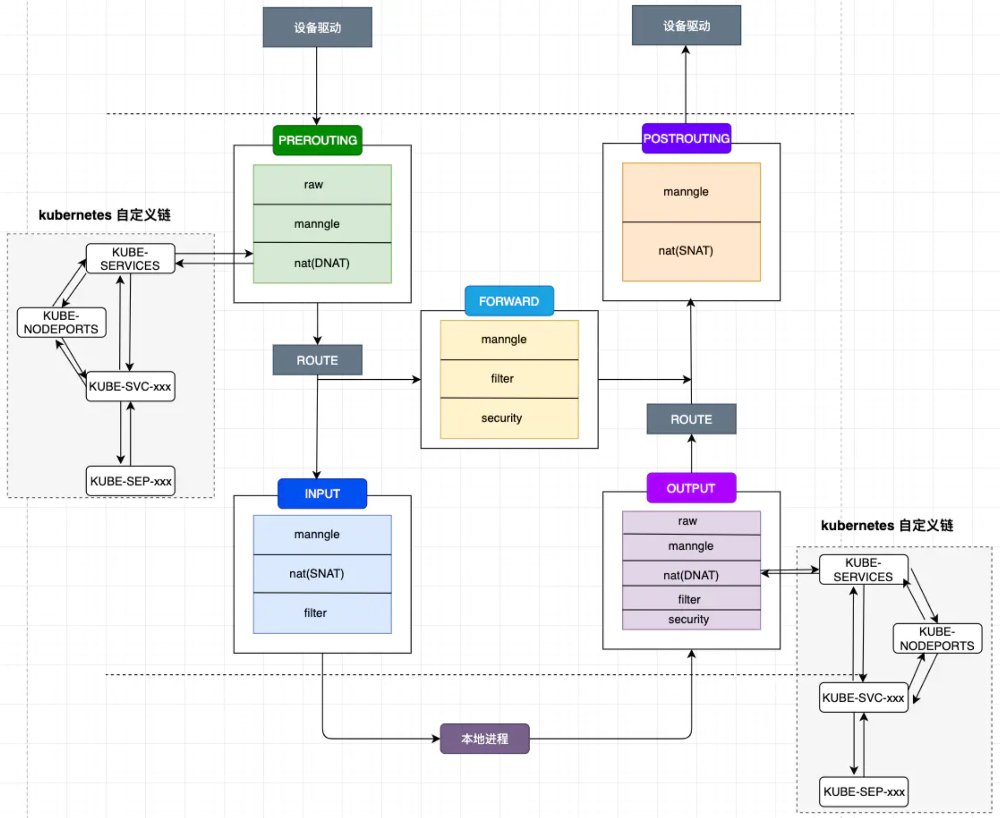

# 前置知识简介

## iptables

### 四表五链

在 IPtables 的体系中根据 Rule 的作用，将其分成4类（或者认为将其分为4个不同的表）：

- filter：负责过滤功能
- nat：网络地址转换功能，典型的比如 SNAT、DNAT
- mangle：解包报文、修改并封包
- raw：关闭 nat 表上启用的连接追踪机制（conntrack）

在 netfilter 内核中的 Hook 点上，一串顺序执行的规则称为链。netfilter 提供了以下5个默认链：

| chain       | 允许表规则               |
| ----------- | ------------------------ |
| PreRouting  | raw, mangle, nat         |
| Forward     | mangle, filter           |
| Input       | mangle, filter           |
| Output      | raw, mangle, nat, filter |
| PostRouting | mangle, nat              |

kube-proxy自定义的链和默认的链表关系如下：



### ACTION

当数据包匹配某条Rule时，我们可以对数据包执行特定ACTION，以下是常用ACTION

| ACTION     | 说明                           | 后续操作     |
| ---------- | ------------------------------ | ------------ |
| ACCEPT     | 允许数据包通过                 | next Chain   |
| DROP       | 丢弃数据包                     | 中断         |
| REJECT     | 丢弃数据包，发送拒绝信息       | 中断         |
| SNAT       | 源地址转换                     | next Chain   |
| DNAT       | 目标地址转换                   | next Chain   |
| REDIRECT   | 目标端口转换                   | next rule    |
| MARK       | 将数据包打上标记               | next rule    |
| RETURN     |                                | parent Chain |
| MASQUERADE | 改写SRC IP为当前IP             | next Chain   |
| LOG        | 记录信息到/var/log             | next rule    |
| MIRROR     | 调换源IP和目的IP，将包发回     | 中断         |
| QUEUE      | 封包放入队列，交给其它程序处理 | 中断         |

### 选项

```
-t, --table table 对指定的表 table 进行操作， table 必须是 raw， nat，filter，mangle 中的一个。如果不指定此选项，默认的是 filter 表。

# 通用匹配：源地址目标地址的匹配
-p：指定要匹配的数据包协议类型；
-s, --source [!] address[/mask] ：把指定的一个／一组地址作为源地址，按此规则进行过滤。当后面没有 mask 时，address 是一个地址，比如：192.168.1.1；当 mask 指定时，可以表示一组范围内的地址，比如：192.168.1.0/255.255.255.0。
-d, --destination [!] address[/mask] ：地址格式同上，但这里是指定地址为目的地址，按此进行过滤。
-i, --in-interface [!] <网络接口name> ：指定数据包的来自来自网络接口，比如最常见的 eth0 。注意：它只对 INPUT，FORWARD，PREROUTING 这三个链起作用。如果没有指定此选项， 说明可以来自任何一个网络接口。同前面类似，"!" 表示取反。
-o, --out-interface [!] <网络接口name> ：指定数据包出去的网络接口。只对 OUTPUT，FORWARD，POSTROUTING 三个链起作用。

# 查看管理命令
-L, --list [chain] 列出链 chain 上面的所有规则，如果没有指定链，列出表上所有链的所有规则。

# 规则管理命令
-A, --append chain rule-specification 在指定链 chain 的末尾插入指定的规则，也就是说，这条规则会被放到最后，最后才会被执行。规则是由后面的匹配来指定。
-I, --insert chain [rulenum] rule-specification 在链 chain 中的指定位置插入一条或多条规则。如果指定的规则号是1，则在链的头部插入。这也是默认的情况，如果没有指定规则号。
-D, --delete chain rule-specification -D, --delete chain rulenum 在指定的链 chain 中删除一个或多个指定规则。
-R num：Replays替换/修改第几条规则

# 链管理命令（这都是立即生效的）
-P, --policy chain target ：为指定的链 chain 设置策略 target。注意，只有内置的链才允许有策略，用户自定义的是不允许的。
-F, --flush [chain] 清空指定链 chain 上面的所有规则。如果没有指定链，清空该表上所有链的所有规则。
-N, --new-chain chain 用指定的名字创建一个新的链。
-X, --delete-chain [chain] ：删除指定的链，这个链必须没有被其它任何规则引用，而且这条上必须没有任何规则。如果没有指定链名，则会删除该表中所有非内置的链。
-E, --rename-chain old-chain new-chain ：用指定的新名字去重命名指定的链。这并不会对链内部造成任何影响。
-Z, --zero [chain] ：把指定链，或者表中的所有链上的所有计数器清零。

-j, --jump target <指定目标> ：即满足某条件时该执行什么样的动作。target 可以是内置的目标，比如 ACCEPT，也可以是用户自定义的链。
-h：显示帮助信息；
```

## ipvs

ipvs是基于内核的负载均衡，比起iptables，有下面的优点：

- 性能更好（iptables 使用链表，ipvs 使用哈希表）
- IPVS 支持比 IPTABLES 更复杂的负载平衡算法（最小负载、最少连接、局部性、加权等）
- IPVS 支持服务器健康检查和连接重试等

### ipset

iptables可以有效的对特定的ip进行封禁，但若需要处理大量ip时，需要添加同等数量的规则，这会导致性能严重下降，并且管理也不够方便和优雅

ipset则很好的解决了这个问题。ipset是iptables的扩展，它允许你创建和匹配整个地址集合的规则。在iptables规则中仅一条规则，就可以匹配到整个集合中的ip，并且，可以对这个集合**动态修改**，而不需要再修改iptables规则，甚至，你可以为特定ip**设置过期时间**，这样，对该ip的封禁在指定的时间后，会自动过期，从而自动解封。

目前kube-proxy用了下面的ip set集合

| set name                       | members                                                      | usage                                                        |
| ------------------------------ | ------------------------------------------------------------ | ------------------------------------------------------------ |
| KUBE-CLUSTER-IP                | All service IP + port                                        | Mark-Masq for cases that `masquerade-all=true` or `clusterCIDR` specified |
| KUBE-LOOP-BACK                 | All service IP + port + IP                                   | masquerade for solving hairpin purpose                       |
| KUBE-EXTERNAL-IP               | service external IP + port                                   | masquerade for packages to external IPs                      |
| KUBE-LOAD-BALANCER             | load balancer ingress IP + port                              | masquerade for packages to load balancer type service        |
| KUBE-LOAD-BALANCER-LOCAL       | LB ingress IP + port with `externalTrafficPolicy=local`      | accept packages to load balancer with `externalTrafficPolicy=local` |
| KUBE-LOAD-BALANCER-FW          | load balancer ingress IP + port with `loadBalancerSourceRanges` | package filter for load balancer with `loadBalancerSourceRanges` specified |
| KUBE-LOAD-BALANCER-SOURCE-CIDR | load balancer ingress IP + port + source CIDR                | package filter for load balancer with `loadBalancerSourceRanges` specified |
| KUBE-NODE-PORT-TCP             | nodeport type service TCP port                               | masquerade for packets to nodePort(TCP)                      |
| KUBE-NODE-PORT-LOCAL-TCP       | nodeport type service TCP port with `externalTrafficPolicy=local` | accept packages to nodeport service with `externalTrafficPolicy=local` |
| KUBE-NODE-PORT-UDP             | nodeport type service UDP port                               | masquerade for packets to nodePort(UDP)                      |
| KUBE-NODE-PORT-LOCAL-UDP       | nodeport type service UDP port with `externalTrafficPolicy=local` | accept packages to nodeport service with `externalTrafficPolicy=local` |

IP

# kube-proxy

一般来说，kube-proxy是Kubernetes核心组件，通过daemonset部署到每个节点上，负责在每个节点设置和service相关的流量规则

目前常用的有iptables和ipvs两种模式(userspace几乎不用)，配置在kube-system的kube-proxy相关的configmap中.

kube-proxy 使用了 iptables 的 filter 表和 nat 表，并对 iptables 的链进行了扩充，自定义了下面的链： 

- `KUBE-SERVICES`（nat.PREROUTING/nat.OUTPUT)：安装在 PREROUTING 和 OUTPUT 链的最开始
  - **将目标地址为 SVCIP:Port 的数据包分派到相应的 KUBE-SVC-xxx 链**
  - **将目标地址为本地网卡的数据包分派到 KUBE-NODEPORTS 链**
- `KUBE-NODEPORTS`：根据 dst-port 匹配NodePort端口
  - 数据包分派到相应的 KUBE-SVC-xxx 链（externalTrafficPolicy=Cluster）
  - 数据包分派到相应的 KUBE-XLB-xxx 链（externalTrafficPolicy=Local）
- `KUBE-SVC-xxx`： 对应 service，充当负载均衡器，将数据包分发到 KUBE-SEP-* 链。KUBE-SEP-* 的数量等于服务背后的端点数量。选择哪个 KUBE-SEP-* 是随机确定的
- `KUBE-XLB-xxx`： 对应 service，数据包可能进入 KUBE-SEP-xxx 链或者被丢弃，在 externalTrafficPolicy 设置为 Local 时有效。使用此链，如果节点没有保留相关端点，则丢弃数据包
- `KUBE-SEP-xxx`： 对应 endpoint 中的IP地址，数据包将 DNAT 到 Pod IP
- KUBE-FIREWALL(filter.INPUT/filter.OUTPUT)：丢弃 0x8000 的包，主要用在 externalTrafficPolicy=Local的场景
- `KUBE-FW-*`：当使用 LoadBalancer 类型部署服务时，chain 会起作用，它将目标 IP 与服务的负载均衡器 IP 匹配，并将数据包分发到相应的 KUBE-SVC-* 链（externalTrafficPolicy：Cluster）或 KUBE-XLB-* 链（externalTrafficPolicy：Local）
- `KUBE-MARK-MASQ`：标记数据包为0x4000（需要SNAT）
- `KUBE-MARK-DROP`：标记数据包为0x8000（DROP包）
- `KUBE-POSTROUTING`（nat.POSTROUTING）：MASQUERADE 0x4000 的包

注意：

- **`物理访问 ClusterIP/NodePort 时，流量从output进入；本地容器中访问 ClusterIP/NodePort 时，流量从 PREROUTING 进入`**
- 如果没有与 selector 匹配的后端 pod，则会将拒绝规则插入 iptables

## Kubernetes插入iptables

为了挂钩包过滤和 NAT，kubernetes 将从 iptables 创建一个自定义链 KUBE-SERVICE，它将所有 PREROUTING 和 OUTPUT 流量重定向到自定义链 KUBE-SERVICE

```
-A PREROUTING -m comment --comment "kubernetes service portals" -j KUBE-SERVICES
...
-A OUTPUT -m comment --comment "kubernetes service portals" -j KUBE-SERVICES
...
```

- PREROUTING 链用于处理来自外部网络的入站流量以及来自 pod 网络的入站流量。

- OUTPUT 链用于处理到外部网络的出站流量以及到 pod 网络的出站流量。

KUBE-SERVICE 链用于服务类型 ClusterIP 和 LoadBalancer，在 KUBE-SERVICE 链的末端，它会安装另一个自定义链 KUBE-NODEPORTS 来处理特定服务类型 NodePort 的流量

```
-A KUBE-SERVICES -m comment --comment "kubernetes service nodeports; NOTE: this must be the last rule in this chain" -m addrtype --dst-type LOCAL -j KUBE-NODEPORTS
```

## iptables原理

基于iptables的kube-proxy的主要职责包括两大块：一块是侦听service更新事件，并更新service相关的iptables规则，一块是侦听endpoint更新事件，更新endpoint相关的iptables规则。也就是说kube-proxy只是作为controller 负责更新更新规则，实现转发服务的是内核的netfilter，体现在用户态则是iptables。

iptables里面，最主要的链是KUBE-SERVICES、KUBE-SVC-* 和KUBE-SEP- *

- KUBE-SERVICES 链是访问集群内服务的数据包入口点，它会根据匹配到的目标IP：port将数据包分发到相应的KUBE-SVC-* 链
- KUBE-SVC-*链相对于一个负载均衡器，它会将数据平均分发到KUBE-SEP-*链，每个KUBE-SVC-*链后面的KUBE-SEP-*都和Service的后端Pod数量一样。
- KUBE-SEP-*链通过DNAT将连接目的地址和端口从Service的IP：port替换为后端Pod的IP：port，从而将流量转发到相应的Pod。

又根据每种service，具体设置的规则不同

### clusterIP

**非本机访问**

```
PREROUTING --> KUBE-SERVICE --> KUBE-SVC-XXX --> KUBE-SEP-XXX
```

**本机访问**

```
OUTPUT --> KUBE-SERVICE --> KUBE-SVC-XXX --> KUBE-SEP-XXX
```

### NodePort

nodePort 方式下，多走了一条**KUBE-NODEPORTS 规则链**

**非本机访问**

```
PREROUTING --> KUBE-SERVICE --> KUBE-NODEPORTS --> KUBE-SVC-XXX --> KUBE-SEP-XXX
```

**本机访问**

```
OUTPUT --> KUBE-SERVICE --> KUBE-NODEPORTS --> KUBE-SVC-XXX --> KUBE-SEP-XXX
```

### loadbalancer

```
# kubectl -n test get svc
NAME                      TYPE           CLUSTER-IP        EXTERNAL-IP      PORT(S)        AGE
my-cip-service            LoadBalancer   192.168.137.76    119.23.191.219   80:30870/TCP   7s
```


```
-A KUBE-FW-GQA5URDNXQJDRZSM -m comment --comment "test/my-cip-service:grpc loadbalancer IP" -j KUBE-MARK-MASQ
-A KUBE-FW-GQA5URDNXQJDRZSM -m comment --comment "test/my-cip-service:grpc loadbalancer IP" -j KUBE-SVC-GQA5URDNXQJDRZSM
-A KUBE-FW-GQA5URDNXQJDRZSM -m comment --comment "test/my-cip-service:grpc loadbalancer IP" -j KUBE-MARK-DROP
-A KUBE-NODEPORTS -p tcp -m comment --comment "test/my-cip-service:grpc" -m tcp --dport 30870 -j KUBE-MARK-MASQ
-A KUBE-NODEPORTS -p tcp -m comment --comment "test/my-cip-service:grpc" -m tcp --dport 30870 -j KUBE-SVC-GQA5URDNXQJDRZSM
-A KUBE-SEP-MCPGL4KGQJVLWIA3 -s 10.130.109.179/32 -m comment --comment "test/my-cip-service:grpc" -j KUBE-MARK-MASQ
-A KUBE-SEP-MCPGL4KGQJVLWIA3 -p tcp -m comment --comment "test/my-cip-service:grpc" -m tcp -j DNAT --to-destination 10.130.109.179:8080
-A KUBE-SERVICES ! -s 10.130.0.0/17 -d 192.168.137.76/32 -p tcp -m comment --comment "test/my-cip-service:grpc cluster IP" -m tcp --dport 80 -j KUBE-MARK-MASQ
-A KUBE-SERVICES -d 192.168.137.76/32 -p tcp -m comment --comment "test/my-cip-service:grpc cluster IP" -m tcp --dport 80 -j KUBE-SVC-GQA5URDNXQJDRZSM
-A KUBE-SERVICES -d 119.23.191.219/32 -p tcp -m comment --comment "test/my-cip-service:grpc loadbalancer IP" -m tcp --dport 80 -j KUBE-FW-GQA5URDNXQJDRZSM
-A KUBE-SVC-GQA5URDNXQJDRZSM -m comment --comment "test/my-cip-service:grpc" -j KUBE-SEP-MCPGL4KGQJVLWIA3
```

## ipvs原理

IPVS 模式的工作原理，其实跟 iptables 模式类似。当我们创建了前面的 Service 之后，kube-proxy 首先会在宿主机上创建一个虚拟网卡（叫作：kube-ipvs0），然后把service ip都挂在下面，**所以ipvs模式下，service ip是可以ping通的**

### clusterIP

```
PREROUTING --> KUBE-SERVICES --> KUBE-CLUSTER-IP --> INPUT --> KUBE-FIREWALL --> POSTROUTING
```

- 进入 PREROUTING 链
- 从 PREROUTING 链会转到 KUBE-SERVICES 链，10.244.0.0/16 为 ClusterIP 网段
- 在 KUBE-SERVICES 链打标记
- 从 KUBE-SERVICES 链再进入到 KUBE-CLUSTER-IP 链
- KUBE-CLUSTER-IP 为 ipset 集合，在此处会进行 DNAT
- 然后会进入 INPUT 链
- 从 INPUT 链会转到 KUBE-FIREWALL 链，在此处检查标记
- 在 INPUT 链处，ipvs 的 LOCAL_IN Hook 发现此包在 ipvs 规则中则直接转发到 POSTROUTING 链

```
-A PREROUTING -m comment --comment "kubernetes service portals" -j KUBE-SERVICES

-A KUBE-SERVICES ! -s 10.244.0.0/16 -m comment --comment "Kubernetes service cluster ip + port for masquerade purpose" -m set --match-set KUBE-CLUSTER-IP dst,dst -j KUBE-MARK-MASQ

// 执行完 PREROUTING 规则,数据打上0x4000/0x4000的标记
-A KUBE-MARK-MASQ -j MARK --set-xmark 0x4000/0x4000

-A KUBE-SERVICES -m set --match-set KUBE-CLUSTER-IP dst,dst -j ACCEPT
```

然后进入INPUT

```
-A INPUT -j KUBE-FIREWALL

-A KUBE-FIREWALL -m comment --comment "kubernetes firewall for dropping marked packets" -m mark --mark 0x8000/0x8000 -j DROP
```

如果进来的数据带有 0x8000/0x8000 标记则丢弃，若有 0x4000/0x4000 标记则正常执行