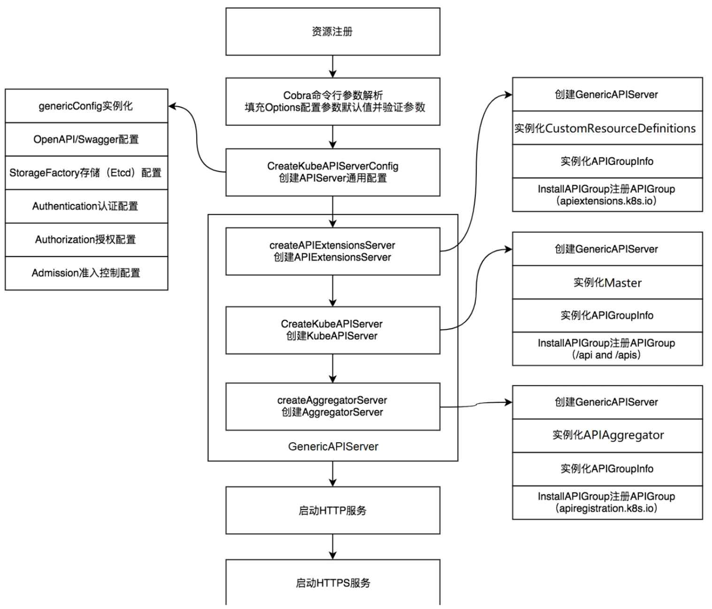

> 基于1.19版本

# 框架

kube-apiserver 基于第三方轻量级框架go-restful ， 其核心数据和流程是 Container -> WebService -> Route

- Route：表示一条请求路由记录，即Resource 的URL Path（URI），go-restful 内置的 RouteSelector（请求路由分发器）根据 Route 将客户端发出的 HTTP 请求路由到相应的 Handler 进行处理
- WebService：一个 WebService 由若干个 Routes 组成，并且 WebService 内的 Routes 拥有同一个 RootPath、输入输出格式、基本一致的请求数据类型等等一系列的通用属性。通常的，我们会根据需要将一组相关性非常强的 API 封装成为一个 WebServiice，继而将 Web Application 所拥有的全部 APIs 划分若干个 Group。
- Container：表示一个 Web Server（服务器），由多个 WebServices 组成，此外还包含了若干个 Filters（过滤器）、一个 http.ServeMux 多路复用器以及一个 dispatch。go-restful 如何在从 Container 开始将路由分发给各个 WebService，再由 WebService 分发给具体的 Handler 函数，这些都在 dispatch 中实现。

```
                                          ┌────────────────┐       ┌──────────────────────────────┐ 
                                        ┌▶│Route Get /books│──────▶│Handler Func(request,response)│ 
                       ┌──────────────┐ │ └────────────────┘       └──────────────────────────────┘ 
                       │  WebService  │ │ ┌─────────────────┐      ┌──────────────────────────────┐ 
                    ┌─▶│    (Books)   │─┼▶│Route Post /books│─────▶│Handler Func(request,response)│ 
                    │  └──────────────┘ │ └─────────────────┘      └──────────────────────────────┘ 
┌─────────────────┐ │                   │ ┌──────────────────────┐  ┌──────────────────────────────┐
│    Container    │ │                   └▶│Route Delete /books:id│─▶│Handler Func(request,response)│
│(Listen IP:Port) │─┤                     └──────────────────────┘  └──────────────────────────────┘
└─────────────────┘ │                                                                               
                    │  ┌──────────────┐   ┌────────────────┐        ┌──────────────────────────────┐
                    │  │  WebService  │ ┌▶│Route Get /user │───────▶│Handler Func(request,response)│
                    └─▶│    (User)    │─┘ └────────────────┘        └──────────────────────────────┘
                       └──────────────┘                                                             
```

# 组件

kube-apiserver 共由 3 个组件构成（Aggregator、KubeAPIServer、APIExtensionServer），这些组件依次通过 Delegation 处理请求：

```
                ┌───────────────────┬─────────────┬────────────────┐              
                │APIExtensionsServer│KubeAPIServer│AggregatorServer│              
                └───────────────────┴─────────────┴────────────────┘              
                          │                │               │                      
                  ┌───────┘               ┌┘               └───────┐              
                  ▼                       ▼                        ▼              
        ┌───────────────────┐   ┌───────────────────┐    ┌───────────────────┐    
        │        CRD        │   │       Master      │    │ AA(APIAggregator) │    
        └───────────────────┘   └───────────────────┘    └───────────────────┘    
                  │                       │                        │              
              ┌───┘                       │                        └─┐            
              ▼                           ▼                          ▼            
┌──────────────────────────┐    ┌───────────────────┐    ┌───────────────────────┐
│extensionsapiserver.Scheme│    │legacyscheme.Scheme│    │aggregatorscheme.Scheme│
└──────────────────────────┘    └───────────────────┘    └───────────────────────┘
                                          │                                       
                                          │                                       
                                          ▼                                       
                         ┌──────────────────────────────────┐                     
                         │genericapiserver.GenerciAPIServer │                     
                         └──────────────────────────────────┘                     
```

- **AggregatorSever**：暴露的功能类似于一个七层负载均衡，将来自用户的请求拦截转发给其他服务器，并且负责整个 APIServer 的 Discovery 功能；Aggregator服务提供了AA （APIAggregator）聚合服务，开发者可通过AA对Kubernetes聚合服务进行扩展，例如，metrics-server是Kubernetes系统集群的核心监控数据的聚合器，它是AggregatorServer服务的扩展实现。API聚合服务通过APIAggregator对象进行管理，并通过aggregatorscheme.Scheme资源注册表管理AA相关资源。
- **KubeAPIServer** ：API核心服务。该服务提供了Kubernetes内置核心资源服务，不允许开发者随意更改相关资源，例如，Pod、Service等内置核心资源会由Kubernetes官方维护。API核心服务通过Master对象进行管理，并通过legacyscheme.Scheme资源注册表管理Master相关资源
- **APIExtensionServer**：主要处理 CustomResourceDefinition（CRD）和 CustomResource（CR）的 REST 请求，也是 Delegation 的最后一环，如果对应 CR 不能被处理的话则会返回 404。

APIExtensionsServer扩展服务和AggregatorServer聚合服务都是可以在不修改Kubernetes核心代码的前提下扩展Kubernetes API的方式。只有KubeAPIServer核心服务是Kubernetes系统运行的基础，不建议随意修改它

## Aggregator

Aggregator 通过 APIServices 对象关联到某个 Service 来进行请求的转发，其关联的 Service 类型进一步决定了请求转发形式。Aggregator 包括一个 `GenericAPIServer` 和维护自身状态的 Controller。其中 `GenericAPIServer` 主要处理 `apiregistration.k8s.io` 组下的 APIService 资源请求。

**Aggregator 除了处理资源请求外还包含几个 controller：**

- 1、`apiserviceRegistrationController`：负责 APIServices 中资源的注册与删除；
- 2、`availableConditionController`：维护 APIServices 的可用状态，包括其引用 Service 是否可用等；
- 3、`autoRegistrationController`：用于保持 API 中存在的一组特定的 APIServices；
- 4、`crdRegistrationController`：负责将 CRD GroupVersions 自动注册到 APIServices 中；
- 5、`openAPIAggregationController`：将 APIServices 资源的变化同步至提供的 OpenAPI 文档；

kubernetes 中的一些附加组件，比如 metrics-server 就是通过 Aggregator 的方式进行扩展的，实际环境中可以通过使用 [apiserver-builder](https://github.com/kubernetes-sigs/apiserver-builder-alpha) 工具轻松以 Aggregator 的扩展方式创建自定义资源。

### 启用 API Aggregation

在 kube-apiserver 中需要增加以下配置来开启 API Aggregation：

```
--proxy-client-cert-file=/etc/kubernetes/certs/proxy.crt
--proxy-client-key-file=/etc/kubernetes/certs/proxy.key
--requestheader-client-ca-file=/etc/kubernetes/certs/proxy-ca.crt
--requestheader-allowed-names=aggregator
--requestheader-extra-headers-prefix=X-Remote-Extra-
--requestheader-group-headers=X-Remote-Group
--requestheader-username-headers=X-Remote-User
```

## KubeAPIServer

KubeAPIServer 主要是提供对 API Resource 的操作请求，为 kubernetes 中众多 API 注册路由信息，暴露 RESTful API 并且对外提供 kubernetes service，使集群中以及集群外的服务都可以通过 RESTful API 操作 kubernetes 中的资源。

## APIExtensionServer

APIExtensionServer 作为 Delegation 链的最后一层，是处理所有用户通过 Custom Resource Definition 定义的资源服务器。

其中包含的 controller 以及功能如下所示：

- 1、`openapiController`：将 crd 资源的变化同步至提供的 OpenAPI 文档，可通过访问 `/openapi/v2` 进行查看；
- 2、`crdController`：负责将 crd 信息注册到 apiVersions 和 apiResources 中，两者的信息可通过 `$ kubectl api-versions` 和 `$ kubectl api-resources` 查看；
- 3、`namingController`：检查 crd obj 中是否有命名冲突，可在 crd `.status.conditions` 中查看；
- 4、`establishingController`：检查 crd 是否处于正常状态，可在 crd `.status.conditions` 中查看；
- 5、`nonStructuralSchemaController`：检查 crd obj 结构是否正常，可在 crd `.status.conditions` 中查看；
- 6、`apiApprovalController`：检查 crd 是否遵循 kubernetes API 声明策略，可在 crd `.status.conditions` 中查看；
- 7、`finalizingController`：类似于 finalizes 的功能，与 CRs 的删除有关；

# 启动

和别的一样，CORBA程序，位置是`cmd/kube-apiserver/apiserver.go`

server 的初始化使用委托模式，通过 DelegationTarget 接口，把基本的 API Server、CustomResource、Aggregator 这三种服务采用链式结构串联起来，对外提供服务



## 资源注册

kube-apiserver组件启动后的第一件事情是将Kubernetes所支持的资源注册到Scheme资源注册表中，这样后面启动的逻辑才能够从Scheme资源注册表中拿到资源信息并启动和运行APIExtensionsServer、KubeAPIServer、AggregatorServer这3种服务。

资源的注册过程并不是通过函数调用触发的，而是通过Go语言的导入（import）和初始化（init）机制触发的

以KubeAPIServer（API核心服务）为例，kube-apiserver导入了legacyscheme和master包。

```
file:// cmd/kube-apiserver/app/server.go
import (
	"k8s.io/kubernetes/pkg/api/legacyscheme"
	"k8s.io/kubernetes/pkg/master"
······
```

kube-apiserver资源注册分为两步：

第1步，初始化Scheme资源注册表(`pkg/api/legacyscheme/scheme.go`)；

第2步，注册Kubernetes所支持的资源。kube-apiserver启动时导入了master包，master包中的import_known_versions.go文件调用了Kubernetes资源下的install包，通过导入包的机制触发初始化函数`pkg/master/import_known_versions.go`

```go
import (
	// These imports are the API groups the API server will support.
	_ "k8s.io/kubernetes/pkg/apis/admission/install"
	_ "k8s.io/kubernetes/pkg/apis/admissionregistration/install"
	_ "k8s.io/kubernetes/pkg/apis/apps/install"
······
	_ "k8s.io/kubernetes/pkg/apis/networking/install"
	_ "k8s.io/kubernetes/pkg/apis/node/install"
)
```

每个Kubernetes内部版本资源都定义install包，用于在kube-apiserver启动时注册资源

## CreateServerChain

`CreateServerChain` 是完成 server 初始化的方法，里面包含 `APIExtensionsServer`、`KubeAPIServer`、`AggregatorServer` 初始化的所有流程，最终返回 `aggregatorapiserver.APIAggregator` 实例，初始化流程主要有：http filter chain 的配置、API Group 的注册、http path 与 handler 的关联以及 handler 后端存储 etcd 的配置。

```go
//file: cmd/kube-apiserver/app/server.go
func CreateServerChain(completedOptions completedServerRunOptions, stopCh <-chan struct{}) (*aggregatorapiserver.APIAggregator, error) {
······
  // 1、为 kubeAPIServer 创建配置
	kubeAPIServerConfig, insecureServingInfo, serviceResolver, pluginInitializer, err := CreateKubeAPIServerConfig(······)

	// 2、判断是否配置了 APIExtensionsServer，创建 apiExtensionsConfig 
	apiExtensionsConfig, err := createAPIExtensionsConfig(·······)

  // 3、初始化 APIExtensionsServer
	apiExtensionsServer, err := createAPIExtensionsServer(·······)

  // 4、初始化 KubeAPIServer
	kubeAPIServer, err := CreateKubeAPIServer(·······)
  
	// 5、创建 AggregatorConfig
	aggregatorConfig, err := createAggregatorConfig(······)

  // 6、初始化 AggregatorServer
	aggregatorServer, err := createAggregatorServer(······)

  // 7、判断是否启动非安全端口的 http server
	if insecureServingInfo != nil {
		insecureHandlerChain := kubeserver.BuildInsecureHandlerChain(aggregatorServer.GenericAPIServer.UnprotectedHandler(), kubeAPIServerConfig.GenericConfig)
		if err := insecureServingInfo.Serve(insecureHandlerChain, kubeAPIServerConfig.GenericConfig.RequestTimeout, stopCh); err != nil {
			return nil, err
		}
	}

	return aggregatorServer, nil
}
```

注意：

- 调用 `CreateKubeAPIServerConfig` 创建 KubeAPIServer 所需要的配置，主要是创建 `master.Config`，其中会调用 `buildGenericConfig` 生成 genericConfig，genericConfig 中包含 apiserver 的核心配置；
- 判断是否启用了扩展的 API server 并调用 `createAPIExtensionsConfig` 为其创建配置，apiExtensions server 是一个代理服务，用于代理 kubeapiserver 中的其他 server，比如 metric-server；
- 注意`AggregatorServer`是最后一个加入delegation chain的

### CreateKubeAPIServerConfig

在 `CreateKubeAPIServerConfig` 中主要是调用 `buildGenericConfig` 创建 genericConfig 以及构建 master.Config 对象

```go
//file: cmd/kube-apiserver/app/server.go
func CreateKubeAPIServerConfig(
    s completedServerRunOptions,
    nodeTunneler tunneler.Tunneler,
    proxyTransport *http.Transport,
) (......) {
    // 1、构建 genericConfig
    genericConfig, versionedInformers, insecureServingInfo, serviceResolver, pluginInitializers, admissionPostStartHook, storageFactory,    lastErr = buildGenericConfig(s.ServerRunOptions, proxyTransport)
    if lastErr != nil {
        return
    }
    ......
    // 2、初始化所支持的 capabilities
    capabilities.Initialize(capabilities.Capabilities{
        AllowPrivileged: s.AllowPrivileged,
        PrivilegedSources: capabilities.PrivilegedSources{
            HostNetworkSources: []string{},
            HostPIDSources:     []string{},
            HostIPCSources:     []string{},
        },
        PerConnectionBandwidthLimitBytesPerSec: s.MaxConnectionBytesPerSec,
    })
    // 3、获取 service ip range 以及 api server service IP
    serviceIPRange, apiServerServiceIP, lastErr := master.DefaultServiceIPRange(s.PrimaryServiceClusterIPRange)
    if lastErr != nil {
        return
    }
    ......
    // 4、构建 master.Config 对象
    config = &master.Config{......}
    if nodeTunneler != nil {
        config.ExtraConfig.KubeletClientConfig.Dial = nodeTunneler.Dial
    }
    if config.GenericConfig.EgressSelector != nil {
        config.ExtraConfig.KubeletClientConfig.Lookup = config.GenericConfig.EgressSelector.Lookup
    }
    return
}
```

#### buildGenericConfig

该函数创建APIServer的通用配置，该配置是kube-apiserver不同模块实例化所需的配置

```go
func buildGenericConfig(
    s *options.ServerRunOptions,
    proxyTransport *http.Transport,
) (......) {
    // 1、为 genericConfig 设置默认值
    genericConfig = genericapiserver.NewConfig(legacyscheme.Codecs)
    genericConfig.MergedResourceConfig = master.DefaultAPIResourceConfigSource()
    if lastErr = s.GenericServerRunOptions.ApplyTo(genericConfig); lastErr != nil {
        return
    }
    ......
    genericConfig.OpenAPIConfig = genericapiserver.DefaultOpenAPIConfig(......)
    genericConfig.OpenAPIConfig.Info.Title = "Kubernetes"
    genericConfig.LongRunningFunc = filters.BasicLongRunningRequestCheck(
        sets.NewString("watch", "proxy"),
        sets.NewString("attach", "exec", "proxy", "log", "portforward"),
    )
    kubeVersion := version.Get()
    genericConfig.Version = &kubeVersion
    storageFactoryConfig := kubeapiserver.NewStorageFactoryConfig()
    storageFactoryConfig.ApiResourceConfig = genericConfig.MergedResourceConfig
    completedStorageFactoryConfig, err := storageFactoryConfig.Complete(s.Etcd)

    // 实例化了storageFactoryConfig对象，该对象定义了kube-apiserver与Etcd的交互方式，例如Etcd认证、Etcd地址、存储前缀等。另外，该对象也定义了资源存储方式，例如资源信息、资源编码类型、资源状态等
    storageFactory, lastErr = completedStorageFactoryConfig.New()

    // 2、初始化 RESTOptionsGetter，后期根据其获取操作 Etcd 的句柄，同时添加 etcd 的健康检查方法
    if lastErr = s.Etcd.ApplyWithStorageFactoryTo(storageFactory, genericConfig); 
  
    // 3、设置使用 protobufs 用来内部交互，并且禁用压缩功能
    genericConfig.LoopbackClientConfig.ContentConfig.ContentType = "application/vnd.kubernetes.protobuf"
    genericConfig.LoopbackClientConfig.DisableCompression = true
    // 4、创建 clientset
    kubeClientConfig := genericConfig.LoopbackClientConfig
    clientgoExternalClient, err := clientgoclientset.NewForConfig(kubeClientConfig)

    versionedInformers = clientgoinformers.NewSharedInformerFactory(clientgoExternalClient, 10*time.Minute)
    // 5、创建认证实例，支持多种认证方式：请求 Header 认证、Auth 文件认证、CA 证书认证、Bearer token 认证、
    // ServiceAccount 认证、BootstrapToken 认证、WebhookToken 认证等
    genericConfig.Authentication.Authenticator, genericConfig.OpenAPIConfig.SecurityDefinitions, err = BuildAuthenticator(s,                 clientgoExternalClient, versionedInformers)

    // 6、创建鉴权实例，包含：Node、RBAC、Webhook、ABAC、AlwaysAllow、AlwaysDeny
    genericConfig.Authorization.Authorizer, genericConfig.RuleResolver, err = BuildAuthorizer(s, versionedInformers)
    ......
    serviceResolver = buildServiceResolver(s.EnableAggregatorRouting, genericConfig.LoopbackClientConfig.Host, versionedInformers)
    authInfoResolverWrapper := webhook.NewDefaultAuthenticationInfoResolverWrapper(proxyTransport, genericConfig.LoopbackClientConfig)
    // 7、审计插件的初始化
    lastErr = s.Audit.ApplyTo(......)

    // 8、准入插件的初始化
    pluginInitializers, admissionPostStartHook, err = admissionConfig.New(proxyTransport, serviceResolver)
  
    err = s.Admission.ApplyTo(......)

    return
}
```

### createAPIExtensionsServer

APIExtensionsServer 是最先被初始化的，在 `createAPIExtensionsServer` 中调用 `apiextensionsConfig.Complete().New` 来完成 server 的初始化

```go
//file: k8s.io/apiextensions-apiserver/pkg/apiserver/apiserver.go
func (c completedConfig) New(delegationTarget genericapiserver.DelegationTarget) (*CustomResourceDefinitions, error) {
    // 1、初始化 genericServer
    genericServer, err := c.GenericConfig.New("apiextensions-apiserver", delegationTarget)

    s := &CustomResourceDefinitions{
        GenericAPIServer: genericServer,
    }
    // 2、初始化 APIGroup Info，APIGroup 指该 server 需要暴露的 API
    // APIGroupInfo对象用于描述资源组信息，其中该对象的VersionedResourcesStorageMap字段用于存储资源与资源存储对象的对应关系，其表现形式为map[string]map[string]rest.Storage（即<资源版本>/<资源>/<资源存储对象>），例如CustomResourceDefinitions资源与资源存储对象的映射关系是v1beta1/customresourcedefinitions/customResourceDefintionStorage
    apiResourceConfig := c.GenericConfig.MergedResourceConfig
    apiGroupInfo := genericapiserver.NewDefaultAPIGroupInfo(apiextensions.GroupName, Scheme, metav1.ParameterCodec, Codecs)
    if apiResourceConfig.VersionEnabled(v1beta1.SchemeGroupVersion) {
        storage := map[string]rest.Storage{}
        customResourceDefintionStorage := customresourcedefinition.NewREST(Scheme, c.GenericConfig.RESTOptionsGetter)
        storage["customresourcedefinitions"] = customResourceDefintionStorage
        storage["customresourcedefinitions/status"] = customresourcedefinition.NewStatusREST(Scheme, customResourceDefintionStorage)
        apiGroupInfo.VersionedResourcesStorageMap[v1beta1.SchemeGroupVersion.Version] = storage
    }
    if apiResourceConfig.VersionEnabled(v1.SchemeGroupVersion) {
        ......
    }
    // 3、注册 APIGroup
    if err := s.GenericAPIServer.InstallAPIGroup(&apiGroupInfo); err != nil {
        return nil, err
    }
    // 4、初始化需要使用的 controller
    crdClient, err := internalclientset.NewForConfig(s.GenericAPIServer.LoopbackClientConfig)

    s.Informers = internalinformers.NewSharedInformerFactory(crdClient, 5*time.Minute)
    ......
    establishingController := establish.NewEstablishingController(s.Informers.Apiextensions().InternalVersion().                    CustomResourceDefinitions(), crdClient.Apiextensions())
    crdHandler, err := NewCustomResourceDefinitionHandler(......)

    s.GenericAPIServer.Handler.NonGoRestfulMux.Handle("/apis", crdHandler)
    s.GenericAPIServer.Handler.NonGoRestfulMux.HandlePrefix("/apis/", crdHandler)
    crdController := NewDiscoveryController(s.Informers.Apiextensions().InternalVersion().CustomResourceDefinitions(),                 versionDiscoveryHandler, groupDiscoveryHandler)
    namingController := status.NewNamingConditionController(s.Informers.Apiextensions().InternalVersion().CustomResourceDefinitions(), crdClient.Apiextensions())
    nonStructuralSchemaController := nonstructuralschema.NewConditionController(s.Informers.Apiextensions().InternalVersion().         CustomResourceDefinitions(), crdClient.Apiextensions())
    apiApprovalController := apiapproval.NewKubernetesAPIApprovalPolicyConformantConditionController(s.Informers.Apiextensions().      InternalVersion().CustomResourceDefinitions(), crdClient.Apiextensions())
    finalizingController := finalizer.NewCRDFinalizer(
        s.Informers.Apiextensions().InternalVersion().CustomResourceDefinitions(),
        crdClient.Apiextensions(),
        crdHandler,
    )
    var openapiController *openapicontroller.Controller
    if utilfeature.DefaultFeatureGate.Enabled(apiextensionsfeatures.CustomResourcePublishOpenAPI) {
        openapiController = openapicontroller.NewController(s.Informers.Apiextensions().InternalVersion().CustomResourceDefinitions())
    }
    // 5、将 informer 以及 controller 添加到 PostStartHook 中
    s.GenericAPIServer.AddPostStartHookOrDie("start-apiextensions-informers", func(context genericapiserver.PostStartHookContext) error {
        s.Informers.Start(context.StopCh)
        return nil
    })
    s.GenericAPIServer.AddPostStartHookOrDie("start-apiextensions-controllers", func(context genericapiserver.PostStartHookContext) error {
        ......
        go crdController.Run(context.StopCh)
        go namingController.Run(context.StopCh)
        go establishingController.Run(context.StopCh)
        go nonStructuralSchemaController.Run(5, context.StopCh)
        go apiApprovalController.Run(5, context.StopCh)
        go finalizingController.Run(5, context.StopCh)
        return nil
    })
    s.GenericAPIServer.AddPostStartHookOrDie("crd-informer-synced", func(context genericapiserver.PostStartHookContext) error {
        return wait.PollImmediateUntil(100*time.Millisecond, func() (bool, error) {
            return s.Informers.Apiextensions().InternalVersion().CustomResourceDefinitions().Informer().HasSynced(), nil
        }, context.StopCh)
    })
    return s, nil
}
```

其中最核心方法是 `s.GenericAPIServer.InstallAPIGroup`，也就是 API 的注册过程，三种 server 中 API 的注册过程都是其核心。

- 首先调用 `c.GenericConfig.New` 按照`go-restful`的模式初始化 Container，在 `c.GenericConfig.New` 中会调用 `NewAPIServerHandler` 初始化 handler，APIServerHandler 包含了 API Server 使用的多种http.Handler 类型，包括 `go-restful` 以及 `non-go-restful`，以及在以上两者之间选择的 Director 对象，`go-restful` 用于处理已经注册的 handler，`non-go-restful` 用来处理不存在的 handler，API URI 处理的选择过程为：`FullHandlerChain-> Director ->{GoRestfulContainer， NonGoRestfulMux}`。在 `c.GenericConfig.New` 中还会调用 `installAPI`来添加包括 `/`、`/debug/*`、`/metrics`、`/version` 等路由信息。三种 server 在初始化时首先都会调用 `c.GenericConfig.New` 来初始化一个 genericServer，然后进行 API 的注册；
- 在实例化APIGroupInfo对象后，完成其资源与资源存储对象的映射，APIExtensionsServer会先判断apiextensions.k8s.io/v1beta1资源组/资源版本是否已启用，如果其已启用，则将该资源组、资源版本下的资源与资源存储对象进行映射并存储至APIGroupInfo对象的VersionedResourcesStorageMap字段中。每个资源（包括子资源）都通过类似于NewREST的函数创建资源存储对象（即RESTStorage）。kube-apiserver将RESTStorage封装成HTTP Handler函数，资源存储对象以RESTful的方式运行，一个RESTStorage对象负责一个资源的增、删、改、查操作。当操作CustomResourceDefinitions资源数据时，通过对应的RESTStorage资源存储对象与genericregistry.Store进行交互。
- 调用 `s.GenericAPIServer.InstallAPIGroup` 在路由中注册 API Resources，此方法非常重要，调用链非常深，主要是为了将需要暴露的 API Resource 注册到 server 中，以便能通过 http 接口进行 resource 的 REST 操作，其他几种 server 在初始化时也都会执行对应的 `InstallAPI`；
  - 遍历APIGroupInfo，将<资源组>/<资源版本>/<资源名称>映射到HTTP PATH请求路径
  - 通过InstallREST函数将资源存储对象作为资源的Handlers方法
  - 最后使用go-restful的ws.Route将定义好的请求路径和Handlers方法添加路由到go-restful中
  - 整个过程为InstallAPIGroup→s.installAPIResources→InstallREST
- 初始化 server 中需要使用的 controller，主要有 `openapiController`、`crdController`、`namingController`、`establishingController`、`nonStructuralSchemaController`、`apiApprovalController`、`finalizingController`；
- 将需要启动的 controller 以及 informer 添加到 PostStartHook 中；

### CreateKubeAPIServer

在`CreateKubeAPIServer` 中调用了 `kubeAPIServerConfig.Complete().New` 来完成相关的初始化操作

```go
//file: pkg/master/master.go
func (c completedConfig) New(delegationTarget genericapiserver.DelegationTarget) (*Master, error) {
    ......
    // 1、初始化 GenericAPIServer
    s, err := c.GenericConfig.New("kube-apiserver", delegationTarget)
    if err != nil {
        return nil, err
    }
    // 2、注册 logs 相关的路由
    if c.ExtraConfig.EnableLogsSupport {
        routes.Logs{}.Install(s.Handler.GoRestfulContainer)
    }
    m := &Master{
        GenericAPIServer: s,
    }
    // 3、安装 LegacyAPI
    if c.ExtraConfig.APIResourceConfigSource.VersionEnabled(apiv1.SchemeGroupVersion) {
        legacyRESTStorageProvider := corerest.LegacyRESTStorageProvider{
            StorageFactory:              c.ExtraConfig.StorageFactory,
            ProxyTransport:              c.ExtraConfig.ProxyTransport,
            ......
        }
        if err := m.InstallLegacyAPI(&c, c.GenericConfig.RESTOptionsGetter, legacyRESTStorageProvider); err != nil {
            return nil, err
        }
    }
    restStorageProviders := []RESTStorageProvider{
        auditregistrationrest.RESTStorageProvider{},
        authenticationrest.RESTStorageProvider{Authenticator: c.GenericConfig.Authentication.Authenticator, APIAudiences: c.GenericConfig.  Authentication.APIAudiences},
        ......
    }
    // 4、安装 APIs
    if err := m.InstallAPIs(c.ExtraConfig.APIResourceConfigSource, c.GenericConfig.RESTOptionsGetter, restStorageProviders...); err != nil {
        return nil, err
    }

    m.GenericAPIServer.AddPostStartHookOrDie("ca-registration", c.ExtraConfig.ClientCARegistrationHook.PostStartHook)
    return m, nil
}
```

#### m.InstallLegacyAPI

方法的主要功能是将 core API 注册到路由中，是 apiserver 初始化流程中最核心的方法之一，不过其调用链非常深.

将 API 注册到路由其最终的目的就是对外提供 RESTful API 来操作对应 resource，注册 API 主要分为两步，第一步是为 API 中的每个 resource 初始化 RESTStorage 以此操作后端存储中数据的变更，第二步是为每个 resource 根据其 verbs 构建对应的路由。`m.InstallLegacyAPI` 的主要逻辑为

- 1、调用 `legacyRESTStorageProvider.NewLegacyRESTStorage` 为 LegacyAPI 中各个资源创建 RESTStorage，RESTStorage 的目的是将每种资源的访问路径及其后端存储的操作对应起来；
- 2、初始化 `bootstrap-controller`，并将其加入到 PostStartHook 中，`bootstrap-controller` 是 apiserver 中的一个 controller，主要功能是创建系统所需要的一些 namespace 以及创建 kubernetes service 并定期触发对应的 sync 操作，apiserver 在启动后会通过调用 PostStartHook 来启动 `bootstrap-controller`；
- 3、在为资源创建完 RESTStorage 后，调用 `m.GenericAPIServer.InstallLegacyAPIGroup` 为 APIGroup 注册路由信息，`InstallLegacyAPIGroup`方法的调用链非常深，主要为`InstallLegacyAPIGroup--> installAPIResources --> InstallREST --> Install --> registerResourceHandlers`，最终核心的路由构造在`registerResourceHandlers`方法内，该方法比较复杂，其主要功能是通过上一步骤构造的 REST Storage 判断该资源可以执行哪些操作（如 create、update等），将其对应的操作存入到 action 中，每一个 action 对应一个标准的 REST 操作，如 create 对应的 action 操作为 POST、update 对应的 action 操作为PUT。最终根据 actions 数组依次遍历，对每一个操作添加一个 handler 方法，注册到 route 中去，再将 route 注册到 webservice 中去，webservice 最终会注册到 container 中，遵循 go-restful 的设计模式；

`InstallAPIs` 与 `InstallLegacyAPI` 的主要流程是类似的

### createAggregatorServer

`AggregatorServer` 主要用于自定义的聚合控制器的，使 CRD 能够自动注册到集群中。

```go
//file: cmd/kube-apiserver/app/aggregator.go
func createAggregatorServer(......) (*aggregatorapiserver.APIAggregator, error) {
    // 1、初始化 aggregatorServer
    aggregatorServer, err := aggregatorConfig.Complete().NewWithDelegate(delegateAPIServer)

    // 2、初始化 auto-registration controller
    apiRegistrationClient, err := apiregistrationclient.NewForConfig(aggregatorConfig.GenericConfig.LoopbackClientConfig)

    autoRegistrationController := autoregister.NewAutoRegisterController(......)
    apiServices := apiServicesToRegister(delegateAPIServer, autoRegistrationController)
    crdRegistrationController := crdregistration.NewCRDRegistrationController(......)
    err = aggregatorServer.GenericAPIServer.AddPostStartHook("kube-apiserver-autoregistration", func(context genericapiserver.PostStartHookContext) error {
        go crdRegistrationController.Run(5, context.StopCh)
        go func() {
            if aggregatorConfig.GenericConfig.MergedResourceConfig.AnyVersionForGroupEnabled("apiextensions.k8s.io") {
                crdRegistrationController.WaitForInitialSync()
            }
            autoRegistrationController.Run(5, context.StopCh)
        }()
        return nil
    })
  
    err = aggregatorServer.GenericAPIServer.AddBootSequenceHealthChecks(
        makeAPIServiceAvailableHealthCheck(
            "autoregister-completion",
            apiServices,
        aggregatorServer.APIRegistrationInformers.Apiregistration().V1().APIServices(),
        ),
    )

    return aggregatorServer, nil
}
```

- 1、调用 `aggregatorConfig.Complete().NewWithDelegate` 创建 aggregatorServer；
- 2、初始化 `crdRegistrationController` 和 `autoRegistrationController`，`crdRegistrationController` 负责注册 CRD，`autoRegistrationController` 负责将 CRD 对应的 APIServices 自动注册到 apiserver 中，CRD 创建后可通过 `$ kubectl get apiservices` 查看是否注册到 apiservices 中；
- 3、将 `autoRegistrationController` 和 `crdRegistrationController` 加入到 PostStartHook 中；

#### aggregatorConfig.Complete().NewWithDelegate

`aggregatorConfig.Complete().NewWithDelegate` 是初始化 aggregatorServer 的方法，主要逻辑为：

- 1、调用 `c.GenericConfig.New` 初始化 GenericAPIServer，其内部的主要功能在上文已经分析过；
- 2、调用 `apiservicerest.NewRESTStorage` 为 APIServices 资源创建 RESTStorage，RESTStorage 的目的是将每种资源的访问路径及其后端存储的操作对应起来；
- 3、调用 `s.GenericAPIServer.InstallAPIGroup` 为 APIGroup 注册路由信息；

```go
//file: 
func (c completedConfig) NewWithDelegate(delegationTarget genericapiserver.DelegationTarget) (*APIAggregator, error) {
    openAPIConfig := c.GenericConfig.OpenAPIConfig
    c.GenericConfig.OpenAPIConfig = nil
    // 1、初始化 genericServer
    genericServer, err := c.GenericConfig.New("kube-aggregator", delegationTarget)

    apiregistrationClient, err := clientset.NewForConfig(c.GenericConfig.LoopbackClientConfig)

    informerFactory := informers.NewSharedInformerFactory(
        apiregistrationClient,
        5*time.Minute, 
    )
    s := &APIAggregator{
        GenericAPIServer: genericServer,
        delegateHandler: delegationTarget.UnprotectedHandler(),
        ......
    }
    // 2、为 API 注册路由
    apiGroupInfo := apiservicerest.NewRESTStorage(c.GenericConfig.MergedResourceConfig, c.GenericConfig.RESTOptionsGetter)
    if err := s.GenericAPIServer.InstallAPIGroup(&apiGroupInfo); err != nil {
        return nil, err
    }
    // 3、初始化 apiserviceRegistrationController、availableController
    apisHandler := &apisHandler{
        codecs: aggregatorscheme.Codecs,
        lister: s.lister,
    }
    s.GenericAPIServer.Handler.NonGoRestfulMux.Handle("/apis", apisHandler)
    s.GenericAPIServer.Handler.NonGoRestfulMux.UnlistedHandle("/apis/", apisHandler)
    apiserviceRegistrationController := NewAPIServiceRegistrationController(informerFactory.Apiregistration().V1().APIServices(), s)
    availableController, err := statuscontrollers.NewAvailableConditionController(
       ......
    )
  
    // 4、添加 PostStartHook
    s.GenericAPIServer.AddPostStartHookOrDie("start-kube-aggregator-informers", func(context genericapiserver.PostStartHookContext) error {
        informerFactory.Start(context.StopCh)
        c.GenericConfig.SharedInformerFactory.Start(context.StopCh)
        return nil
    })
    s.GenericAPIServer.AddPostStartHookOrDie("apiservice-registration-controller", func(context genericapiserver.PostStartHookContext)      error {
        go apiserviceRegistrationController.Run(context.StopCh)
        return nil
    })
    s.GenericAPIServer.AddPostStartHookOrDie("apiservice-status-available-controller", func(context genericapiserver.PostStartHookContext)  error {
        go availableController.Run(5, context.StopCh)
        return nil
    })
    return s, nil
```

## server.PrepareRun

`server.PrepareRun` 主要完成了健康检查、存活检查和`OpenAPI`路由的注册工作

## prepared.Run

主要调用 `s.NonBlockingRun` 来完成启动工作

```go
//file: staging/src/k8s.io/apiserver/pkg/server/genericapiserver.go
func (s preparedGenericAPIServer) Run(stopCh <-chan struct{}) error {
    delayedStopCh := make(chan struct{})
    go func() {
        defer close(delayedStopCh)
        <-stopCh
        time.Sleep(s.ShutdownDelayDuration)
    }()
    // 调用 s.NonBlockingRun 完成启动流程
    err := s.NonBlockingRun(delayedStopCh)
    if err != nil {
        return err
    }
    // 当收到退出信号后完成一些收尾工作
    <-stopCh
    err = s.RunPreShutdownHooks()
    if err != nil {
        return err
    }
    <-delayedStopCh
    s.HandlerChainWaitGroup.Wait()
    return nil
}
```

`s.NonBlockingRun` 的主要逻辑为：

- 1、判断是否要启动审计日志服务；
- 2、调用 `s.SecureServingInfo.Serve` 配置并启动 https server；
- 3、执行 postStartHooks；
- 4、向 systemd 发送 ready 信号；